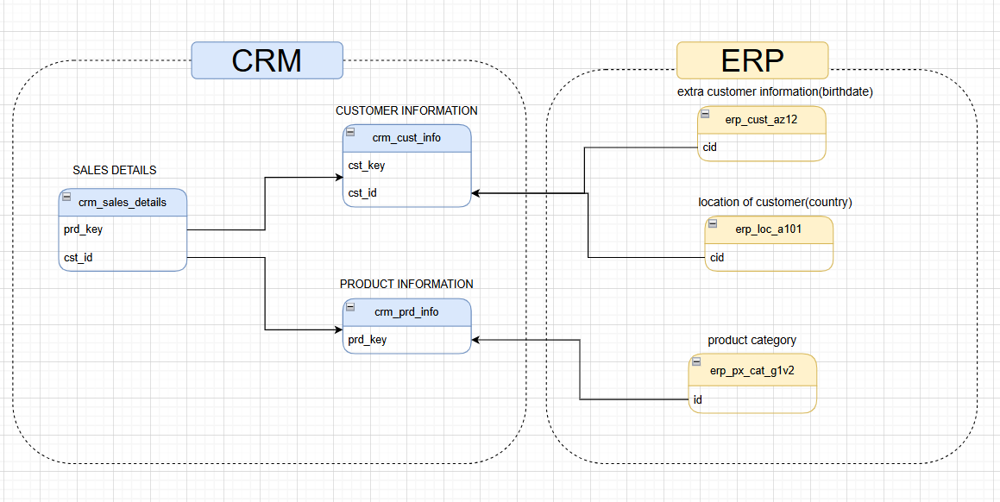

# Retail Data Warehouse & Analytics

## 📌 Project Overview

This project demonstrates the design and implementation of an end-to-end Retail Data Warehouse using a Medallion Architecture (Bronze, Silver, Gold layers). 

The solution integrates data from multiple operational systems (CRM and ERP), transforms raw data into business-ready structures, and performs advanced SQL-based analytics for performance evaluation and reporting.

---

## 🎯 Business Objective

A retail company requires a centralized data warehouse to:

- Consolidate data from CRM and ERP systems
- Clean and standardize raw operational data
- Build a dimensional model for business reporting
- Analyze product and customer performance
- Enable data-driven decision-making

---

## 🏗️ Architecture Overview

The project follows a Medallion Architecture:

- **Bronze Layer** → Raw data ingestion
- **Silver Layer** → Data cleaning & transformation
- **Gold Layer** → Business-ready dimensional model
- **Analytics Layer** → Advanced SQL analysis & reporting


---

## 🔗 Source System Integration

The warehouse integrates data from:

- **CRM System** → Sales and customer information
- **ERP System** → Product details and customer location data



---

## ⭐ Dimensional Model (Star Schema)

The Gold layer follows a Star Schema design with a central fact table connected to dimension tables.

- **fact_sales**
- **dim_customers**
- **dim_products**


---

## 🗄️ Data Layers

### 🥉 Bronze Layer
- Raw table creation
- Bulk data ingestion
- No transformations applied
- Stores source data as-is

### 🥈 Silver Layer
- Data cleansing
- Deduplication using `ROW_NUMBER()`
- Standardization of categorical values
- Data validation and correction
- Transformation logic implemented using stored procedures

### 🥇 Gold Layer
- Creation of dimension tables:
  - `dim_customers`
  - `dim_products`
- Creation of fact table:
  - `fact_sales`
- Surrogate key implementation
- Business-ready schema design

---

## 📊 Analytics & Reporting

Advanced SQL queries were written using:

- CTEs (Common Table Expressions)
- Window Functions (`LAG`, `AVG`, `ROW_NUMBER`)
- Performance comparison logic
- Year-over-Year growth analysis
- Part-to-whole contribution analysis
- Cumulative trend analysis

Reports included:

- Customer Performance Report
- Product Performance Report
- Change Over Time Analysis
- Magnitude & Contribution Analysis

---

## 🛠️ Technologies Used

- SQL Server
- T-SQL
- Stored Procedures
- Window Functions
- Dimensional Modeling
- Draw.io (for architecture diagrams)
- GitHub (version control)

---

## 🚀 Key Skills Demonstrated

- Data Warehouse Design
- Medallion Architecture
- ETL Development
- Dimensional Modeling (Star Schema)
- Advanced SQL Analytics
- Business Reporting
- Data Documentation

---

## 📁 Project Structure

```bash
retail-data-warehouse-analytics
│
├── 1_bronze_layer
├── 2_silver_layer
├── 3_gold_layer
├── 4_analytics
├── reports
├── documents
└── README.md
```

### Folder Details

- **1_bronze_layer** → Raw data ingestion (staging & bulk load)
- **2_silver_layer** → Data cleansing and transformation
- **3_gold_layer** → Dimensional model (fact & dimension tables)
- **4_analytics** → Advanced SQL analysis
- **reports** → Final reporting queries
- **documents** → Architecture diagrams & data catalog

---

## 📈 Outcome

This project successfully:

- Built a scalable retail data warehouse
- Integrated multi-source data
- Designed a dimensional model
- Enabled performance-based analytics
- Delivered structured SQL reporting outputs

---

## 👤 About me

Hi! i'm Sadeep Dudekula  
Aspiring Data Analyst | SQL | Data Warehousing | Business Analytics
